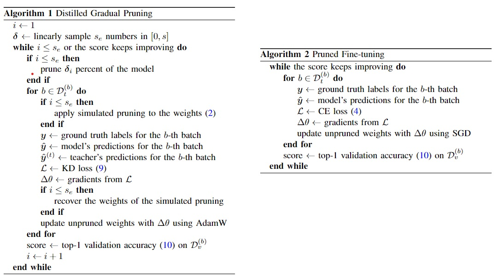
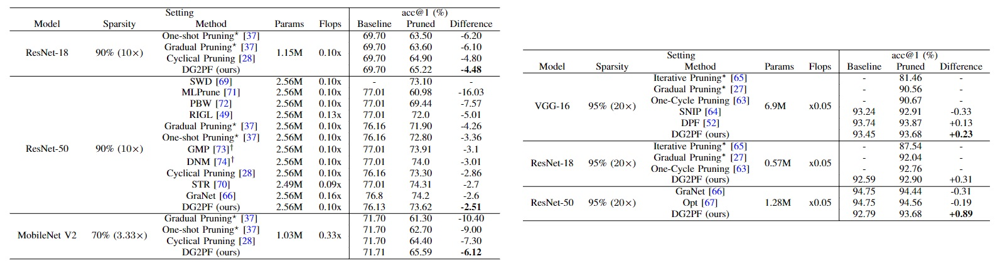

Hey there!

Just a quick note to let you know that the code is actually out there. But, give us about a week or two (from today, 12/03/2024) because we're planning to spruce it up a bit and put together a readme for you. We'll kick off the repo and circle back with you in two weeks!

Update 1 (21/03/2024):

# Distilled Gradual Pruning with Pruned Fine-tuning

<p align="center">
<a href="https://ieeexplore.ieee.org/document/10438214" alt="arXiv">
</p>

---

This is a PyTorch implementation of the **Distilled Gradual Pruning with Pruned Fine-tuning (DG2PF)** algorithm proposed in our paper "[Distilled Gradual Pruning with Pruned Fine-tuning (DG2PF)](https://ieeexplore.ieee.org/document/10438214)".

**Note**: DG2PF focuses on the optimization of neural networks through knowledge distillation and magnitude-based pruning, improving efficiency without compromising the performance of pre-trained networks.

<p align="center">
  
</p>

Figure 1: **Overview of DG2PF** showing the algorithm proposed for magnitude-based pruning and knowledge distillation to optimize pre-trained neural networks effectively.


## Image Classification
### 1. Requirements

For detailed requirements, refer to `requirements.txt` which can be installed using the following command:

```bash
pip install -r requirements.txt
```

Data preparation: <insert instructions or script for dataset setup>
### Data Preparation

For ImageNet data preparation, please organize the dataset into the following directory structure:

```
│ImageNet/
├── train/
│   ├── n01440764/
│   │   ├── n01440764_10026.JPEG
│   │   ├── n01440764_10027.JPEG
│   │   ├── ...
│   ├── ...
├── val/
│   ├── n01440764/
│   │   ├── ILSVRC2012_val_00000293.JPEG
│   │   ├── ILSVRC2012_val_00002138.JPEG
│   │   ├── ...
│   ├── ...
```

You can obtain the ImageNet dataset from the official [ImageNet website](http://www.image-net.org/) or other sources that provide the dataset. Ensure you follow the rules and regulations of the dataset provider.

If you require a script to assist in downloading or arranging the ImageNet dataset, you may use the following script:
https://gist.github.com/BIGBALLON/8a71d225eff18d88e469e6ea9b39cef4

### 2. Models

<p align="center">
  
</p>

### 3. Usage

To run the DG2PF model, execute the `main.py` script with necessary command-line arguments. Below is the structure for the command:

```bash
python main.py --dataset_name <dataset_option> --model_name <model_option> --teacher_name <teacher_option> --pruning_percent <prune_percentage>
```

- `--dataset_name`: Specify the dataset to be used. Options include `"imagenet"` or `"cifar10"`.
- `--model_name`: Define the model architecture. Available options are within `{vgg, mobilenet, resnet18, resnet34, resnet50, vit, vit_b_16, vit_b_32, swin_s, deit_s, deit_b, faster_rcnn}`.
- `--teacher_name`: Choose the teacher model for knowledge distillation. Use the same options as `--model_name` or `"same"` to use an identical architecture as the model itself.
- `--pruning_percent`: Set the pruning percentage, a float value > 0 and < 1, representing the proportion of weights to prune.

Additional parameters are available at the top of `main.py`.

For example, to initiate training with a ResNet-50 model on the ImageNet dataset, use the following command:

```bash
python main.py --dataset_name "imagenet" --model_name "resnet50" --teacher_name "same" --pruning_percent 0.9
```

This will configure the script to prune 90% of the ResNet-50 model weights while employing self-knowledge distillation.


### If you find this work useful in your research, please consider citing us. Moreover, should you encounter any issues with the code, do not hesitate to post your queries on GitHub. We strive to respond promptly and assist you with your concerns.

